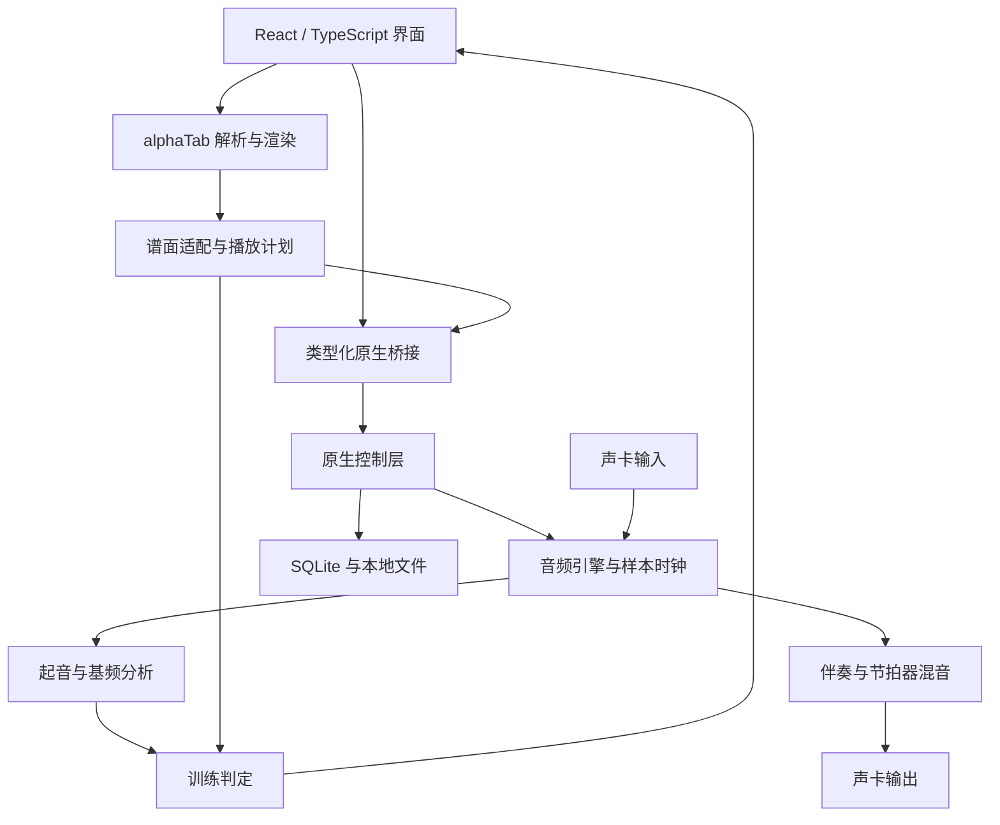

# 电吉他学习软件：可实施开发框架

版本：v1.0｜日期：2026-09-30｜目标平台：Windows 11 x64，Windows 10 兼容性另行测试。

本文是开发设计，不代表已经完成硬件验证。文中延迟、准确率、工期均为工程目标或估算；必须通过原型测试后再对外承诺。

## 1. 产品目标与技术结论

开发一个本地运行的电吉他练习工作台：电吉他通过声卡接入，实时显示输入电平、音高和指板候选位置；导入 Guitar Pro 乐谱，播放伴奏并进行单音跟谱训练，提供循环、变速、调音、节拍器、录音回放和练习统计。

**主架构：C++20 / JUCE 原生桌面主程序 + WebView2 内嵌 React / TypeScript 界面 + alphaTab 乐谱解析与渲染 + 原生音频调度与评分。**

选择理由：JUCE 负责音频设备及实时回调；alphaTab 处理复杂谱文件；前端集中做谱面和交互；音频采集、伴奏、节拍器和评分统一到原生时间轴。官方资料确认了这些基础组件的相关能力，但组件组合、同步和硬件兼容仍需开发验证。[1–7]

首版不使用云端音频识别，不要求账号或网络，不加入大模型参与实时判音。联网 AI 教练可作为后续独立功能。

### 1.1 必须明确的能力边界

| 用户期望 | 可实施方案 | 产品表达 |
|---|---|---|
| 弹奏实时可视化 | 输入电平、单音音高、音分、历史音高曲线 | 显示实际检测值和置信度 |
| 看到自己弹的弦和品 | 根据音高列出多个候选位置；跟谱时突出谱面目标位置 | 区分“谱面目标”和“音高候选”，不能声称识别了实际指法 |
| 单音跟谱打分 | 起音检测、基频估计、预期音符匹配 | 首版正式支持 |
| 和弦、扫弦 | 正常展示谱面和播放伴奏，支持录音自查 | 首版不进行完整和弦正确率评分 |
| 推弦、滑音、揉弦 | 显示目标技巧与音高轨迹 | 后续分技巧验证，不强行套普通单音评分 |
| 任意音频自动变成吉他谱 | 独立的转录研究任务 | 不纳入首版 |

普通单路拾音器把各弦声音混合；同一音高可出现在不同弦上。若未来必须准确区分弦，需要分弦拾音或具有弦通道信息的专用硬件。

## 2. 功能范围与版本

| 模块 | MVP：能真实练习 | v1：日常完整使用 | 后续增强 |
|---|---|---|---|
| 设备接入 | ASIO / WASAPI 设备、输入通道、采样率、缓冲区选择；电平、削波提示 | 配置档案、重连、诊断导出 | 更多设备矩阵、其他操作系统 |
| 实时可视化 | 音名、音分、置信度、指板候选、谱面目标 | 音高轨迹、节奏偏差条 | 可选音符跑道与轻量 3D |
| 调音器 | 六弦标准调弦、A4 参考频率设置 | Drop D、降半音、自定义调弦 | 七弦、八弦专项优化 |
| 乐谱 | GP3/4/5、GPX、GP 文件导入；音轨选择、六线谱 | 曲库、收藏、标签、五线谱、缩放 | 经单独验证后增加 MIDI / MusicXML |
| 播放 | MIDI 伴奏、播放暂停、定位、目标轨静音、速度比例 | 独奏、各轨音量、循环渐进提速 | 音频伴奏变速不变调 |
| 训练 | 单音定速跟谱；计入、A–B 循环；音高与节奏分别反馈 | 等待模式、错音片段重练、分段目标 | 和弦及技巧专项识别 |
| 节拍器 | BPM、拍号、重音、细分、预备拍 | 渐进提速、间歇静音节拍 | 自定义节奏模板 |
| 基础练习 | 爬格子、单音音阶、节奏练习 | 音程、指板音名、听音练习、和弦图与换和弦计时 | 结构化课程 |
| 录音 | 本地干声录音、回放 | 干声与伴奏分轨、练习记录关联 | 音色预设、效果链 |
| 统计 | 本次命中、漏音、提前/滞后、无法判定比例 | 历史趋势、每日目标、错音分布 | 个性化计划 |

“支持文件格式”不等于完整还原该格式所有技巧、音色和播放行为。以实际样本测试形成兼容表；Guitar Pro 8 的 `.gp` 文件也必须单独验收，不能仅凭扩展名承诺。[1,2]

## 3. 硬件路径和首次使用

推荐连接：电吉他 → 声卡 Hi-Z / Instrument 输入 → USB → 电脑；有线耳机接同一声卡输出。

效果器具备 USB 音频时也可接入，但需确认能提供干声通道。手机耳麦口不能作为默认电吉他输入方案。蓝牙耳机不作为低延迟训练验收设备。

首次运行向导：

1. 选择驱动后端和设备，展示真实可用输入输出通道。
2. 选择吉他输入，拨弦检查电平；提示静音、输入过小、削波、通道选错。
3. 选择 48 kHz，尝试设备支持的 128 或 256 样本；不支持时显示实际协商值。
4. 优先使用同一声卡输入和输出；跨设备输入输出暂不正式支持，避免时钟漂移。
5. 调音并采集数秒背景噪声，建立门限。
6. 选择硬件直通监听或软件监听，避免两路叠加产生回声。
7. 完成延迟校准并播放一段内置单音练习，确认谱面、声音和反馈一致。

ASIO 优先选择厂商驱动；无可用驱动时尝试 WASAPI。独占模式可能被其他程序占用，共享模式作为兼容路径。不要静默安装或切换第三方聚合驱动。Microsoft 文档说明，Windows 低延迟能力受设备和驱动共同影响。[7]

## 4. 总体架构



图中“播放计划→训练判定”和“判定→界面”是逻辑数据关系，实际通过原生桥接与线程队列传递。

### 4.1 技术栈与职责

| 层 | 选择 | 职责与约束 |
|---|---|---|
| 原生程序 | C++20、JUCE、CMake | 设备管理、音频回调、窗口、线程与本地文件 |
| 界面 | React、TypeScript、Vite | 工作台、曲库、设置、练习反馈 |
| 内嵌浏览器 | JUCE WebBrowserComponent + WebView2 | 打包本地前端；建立受限双向桥接 [5] |
| 乐谱 | alphaTab，锁定验证后的具体版本 | 导入、模型、六线谱渲染、MIDI 生成 [1–4] |
| MIDI 合成 | TinySoundFont + 获准分发的 GM SoundFont | 原生回调中生成伴奏；音色与 Guitar Pro RSE 不等同 [8] |
| DSP | 自行实现或使用许可合适实现的 YIN 类基频算法；瞬态起音检测 | 先验证干净单音；参考算法不能直接视为成品判音器 |
| 本地存储 | SQLite + JSON 配置 + WAV 文件 | 曲库索引、练习结果、设备配置、录音 |
| 验证与发布 | C++ 单元测试、前端测试、Windows CI、安装包 | 真实声卡测试由本机补充，CI 不替代 |

不再额外引入 Electron、Tauri 或 Python 常驻服务，避免重复桌面外壳和多套音频链路。Python 可用于离线分析测试结果。

### 4.2 音频线程边界

- **实时回调**：读输入、写入预分配环形缓冲、执行已排程 MIDI/节拍事件、混音输出、推进样本计数。
- **DSP 工作线程**：从环形缓冲取连续帧，计算起音与音高；生成带样本位置的检测事件。
- **控制/调度线程**：处理播放、跳转、变速、循环、评分状态机；预先构建播放计划。
- **磁盘线程**：写 WAV、数据库和诊断日志。
- **UI 线程**：30–60 Hz 刷新可视化；不能决定音符何时发声。

实时回调禁止阻塞锁、文件 IO、JSON 编解码、网络访问和不可控堆分配。队列溢出要记录音频缺口，相关片段标记无效，不能继续给出正常评分。

## 5. 实时检测与指板显示

### 5.1 输入分路

干声输入同时送入检测、干声录音和可选监听。失真、压缩、混响等监听效果应在分路后处理，不能污染检测输入。已带重度失真的外部输入属于受限场景。

预处理采用去直流、温和滤波、噪声门限及削波检测；避免过高高通截止频率删除低音弦基频。门限使用滞回，防止弱音尾部反复开关。

### 5.2 起始参数与处理流程

建议原型参数：48 kHz；分析窗 2048 样本，低音时允许 4096；步长 256；检测范围先覆盖约 65–1400 Hz。2048 和 4096 样本分别对应约 42.7 和 85.3 ms 窗长，因此“128 样本声卡缓冲”绝不等于整体识别延迟只有 2.7 ms。

流程：

1. 并行提取能量变化和频谱变化，估计起音样本位置。
2. 执行基频估计，输出频率、算法置信度及有效性。
3. 排除明显噪声、削波和八度跳变；用短时稳定性提高置信度。
4. 保留连续音高用于调音和音高曲线，同时生成离散音符候选。
5. 将后续确认的音高关联回前面的起音事件；评分用起音位置，不用结果到达时间。

换算：`midiFloat = 69 + 12 × log2(frequencyHz / referenceA4Hz)`；相对目标音的音分差为 `1200 × log2(frequencyHz / targetHz)`。

目标谱面仅用于消歧和匹配，不能在弱信号时直接填成目标音。无可靠输入必须显示“未检测到”或“无法判定”。

### 5.3 指板规则

内部约定 1 弦为最高音弦、6 弦为最低音弦；标准调弦从 1 到 6 弦为 MIDI `[64,59,55,50,45,40]`。导入适配器显式转换源库弦序，禁止隐式沿用。

候选品位为检测 MIDI 音高减该弦空弦音高，并考虑变调夹和实际调弦；只展示可演奏范围内候选。自由弹奏显示多个候选，跟谱时独立突出目标弦品。

## 6. Guitar Pro 导入与统一播放计划

### 6.1 导入链路

文件选择 → 格式识别和体积限制 → alphaTab 解析 → 保留原始 Score → 本应用适配模型 → 编译播放展开顺序 → 生成伴奏事件及评分目标 → 输出兼容性报告。

谱面继续使用 alphaTab 原始模型渲染；训练不直接依赖其可变对象。保留原文件、文件哈希、解析器版本和适配器版本，升级后可重新导入与追踪差异。

### 6.2 必须处理的乐谱语义

| 项目 | 实现要求 |
|---|---|
| 多轨 | 用户选择训练轨；其他轨伴奏，鼓轨不参与吉他评分 |
| 调弦、变调夹、移调 | 区分记谱位置与实际发声音高；与 MIDI 输出核对 |
| 拍号、速度变化 | 使用 tempo map；不能全曲按一个 BPM 换算 |
| 三连音、附点、多声部 | 保留真实时值；不能按格子数均分 |
| 反复、第一第二结尾、跳转 | 建立展开后的播放出现次序，每次重复独立编号 |
| 延音线 | 合并为一次发声目标，不能要求重新拨弦 |
| 休止符 | 区分额外弹奏和自然尾音，不以门限残响直接扣分 |
| 和弦 | 渲染和播放；MVP 评分排除并说明原因 |
| 推弦、滑音、泛音、击勾弦、闷音 | 保留技巧标签；未经专项验证的目标不进入普通评分分母 |

### 6.3 最容易返工的集成点

alphaTab 提供 MIDI 生成器与 tick cache，可用于建立乐谱拍与播放 tick 的关联。[3,4] **仅导出一个 MIDI 文件不足以保留可靠的弦品、原始音符身份和每次反复位置。**

开发时建立 `ScorePlaybackAdapter`：从同一遍播放展开中产出 MIDI 事件、训练目标和谱面映射。保留 `sourceNoteId / sourceBeatId`，每次实际出现另设 `occurrenceId`。把延音合并、重复计数、tempo map 和技巧标记写成适配器测试。

M0 必须确认所锁定版本的公开 API 能暴露足够信息。如果需要库内扩展，应限定在适配器或小型可维护补丁中并记录升级成本；不能假定任意内部 API 稳定。若遇复杂跳转无法验证，导入报告明确禁用该曲的评分或对应范围，不能静默错位。

训练时关闭浏览器音频输出，由原生引擎播放。谱面光标使用原生播放位置到 beat/occurrence 的映射驱动；若内置光标接口不适合外部时钟，使用谱面位置映射叠加自有光标。此项也必须在 M0 验证。

## 7. 时钟、伴奏与延迟校准

### 7.1 唯一主时钟

以原生音频引擎的连续样本计数为主时钟。乐谱 tick 是音乐位置单位，通过 tempo map 映射到输出样本位置。PPQ 从生成结果读取或明确统一转换，不能猜测固定数值。

恒定速度段：`seconds = deltaTicks / PPQ × 60 / BPM`。速度比例为 r 时，该段时长除以 r。跨速度段分段积分。

伴奏、节拍器和计入事件按样本调度；回调内在事件偏移处切分渲染。浏览器定时器只用于绘图。暂停、跳转、循环和改速产生新的 `transportEpoch`，清除旧检测待决队列，避免旧音符记到新位置。

循环到头应先处理 note-off、延音踏板和残留合成声音，再按新轮次开始；边界跨越的延音按明确规则截断或恢复，保持播放与评分一致。

### 7.2 延迟分别测量

| 指标 | 定义 | 原型目标 |
|---|---|---|
| 软件监听往返延迟 | 模拟输入到监听模拟输出 | 参考 ASIO 硬件争取 ≤20 ms；实测后标注 |
| 稳定音高反馈延迟 | 实际起音到可靠检测结果 | 干净单音 P95 ≤120 ms；低音单独统计 |
| 视觉偏差 | 谱面目标时刻与可听伴奏时刻差 | 校准后目标 ≤50 ms，无持续累积漂移 |
| 校准后节奏偏差 | 已知测试起音与判定起音偏差 | 参考设备中位绝对偏差目标 ≤25 ms |

这些是不同指标，不能相互替代。声卡报告值仅作初始估计，不当作实际测量结果。

### 7.3 校准实现

定义 `offsetSamples` 为“已知输出事件在输入检测坐标中被观察到的样本位置，减去该输出事件的排程位置”。评分残差使用：

`timingErrorMs = (detectedOnsetSample - expectedOutputSample - offsetSamples) / sampleRate × 1000`。

输出到输入的物理回环最适合测固定链路偏移；需使用匹配的线路电平连接，不把高电平输出直接接不合适的输入。重复测量取中位数并保留离散程度。若检测器已回溯起音，不再重复减窗长；使用测试验证偏移符号。

没有回环时提供手动校准与节拍跟弹估计，明确后者混入人的反应误差，不能当纯硬件延迟。视觉补偿单独管理。

校准档案绑定驱动、设备、采样率、缓冲区和监听路径；任一变化要求重验。若回环使用不同于实际吉他输入的端口，记录该差异并补充验证。

## 8. 训练判定

### 8.1 匹配策略

定速跟谱先做有限时间窗口内的顺序一对一匹配，无需首版引入复杂自动跟随算法。依据校准后的起音残差、音高差和置信度匹配预期目标，禁止一次实际起音命中多个普通目标。

起始阈值建议：普通单音音高容差 ±50 音分；初学节奏窗口 ±150 ms，严格模式 ±80 ms。实际窗口还要小于相邻目标间隔的一定比例，避免快段交叉匹配；所有参数都由验证集校准。

连续相同音必须检测到新的起音才能再次命中；延音线不要求再次起音。相邻音余响、弱拨弦、自然滑动造成的不稳定结果，优先返回无法判定，不制造虚假精准结果。

### 8.2 结果与统计

| 状态 | 定义 |
|---|---|
| 命中 | 存在可靠实际音，音高与起音均在窗口内 |
| 音高错误 | 有可靠起音，但音高不符合目标 |
| 提前 / 滞后 | 可关联目标，节奏偏差超出容差 |
| 漏音 | 有效录音覆盖下，判定期限内没有目标起音 |
| 额外音 | 有可靠起音，但无法关联任何可评分目标 |
| 无法判定 | 信号质量不足、多音混叠或分析异常 |
| 排除 | 目标含首版不支持技巧或为和弦 |

普通弱信号的“无法判定”仍保留在应评分目标总数中并单列，不能通过排除它抬高正确率。设备断开、丢帧等技术无效区间暂停评分并单独报告；不支持目标计入覆盖率统计，但不计普通音符准确率。

建议先显示：目标总数、可评分覆盖率、命中比例、无法判定比例、起音偏差中位数、提前/滞后分布。不要急着合并成不透明的百分制总分。

### 8.3 等待模式与进阶练习

等待模式没有连续真实时间节奏成绩：停在下一个目标，检测正确音后推进，并暂停或重排伴奏。先支持无连续伴奏的逐音练习，再实现整段完成后续播；不能让伴奏继续跑而谱面等待。

循环渐进提速在整轮结束后更新速度；连续达到目标再增加 2–5 BPM，失败可保持速度。门槛、步长和次数可配置。

## 9. 数据模型与桥接协议

### 9.1 核心模型

```typescript
type TrainingTarget = {
  id: string;
  sourceNoteId: string;
  sourceBeatId: string;
  occurrenceId: string;
  trackId: string;
  stringNumber: number; // 1 = 最高音弦
  fret: number;
  soundingMidi: number;
  startTick: number;
  durationTicks: number;
  techniques: string[];
  grading: 'singleNote' | 'excluded';
  exclusionReason?: string;
};

type DetectionEvent = {
  eventId: string;
  transportEpoch: number;
  onsetSample: string;   // JSON 十进制字符串，对应原生 int64
  frameStartSample: string;
  frameEndSample: string;
  frequencyHz: number | null;
  confidence: number;
  rmsDbfs: number;
  clipped: boolean;
  validity: 'valid' | 'noise' | 'uncertain' | 'audioGap';
};
```

同时定义 `ScoreDocument`、`TempoSegment`、`PlaybackOccurrence`、`MidiEvent`、`DeviceProfile`、`CalibrationProfile`、`PracticeSession` 和 `NoteAssessment`。数据库使用独立稳定 ID；session 固化谱文件哈希、算法版本、阈值、调弦、校准与速度设置，保证结果可解释。

### 9.2 桥接契约

命令包括 `listDevices / configureAudio / loadPlaybackPlan / play / pause / seek / setLoop / setSpeed / startRecording / stopRecording`。

事件包括 `deviceState / transportPosition / inputLevel / pitchFrame / assessment / recordingState / diagnostic`。

每条命令带 `protocolVersion / requestId / type / payload`；回复包含成功状态或可读错误码。实时样本不逐帧发给前端，只传降采样波形和检测结果。谱计划分块加载并确认完整后切换，不能边加载边播放不完整计划。

桥接只接受白名单操作；不把 shell 执行、任意本地文件读取或原生对象直接开放给页面。生产版只加载打包界面，外部链接用系统浏览器打开。

### 9.3 存储与导入安全

SQLite 表建议：`songs / song_tracks / practice_sessions / note_assessments / device_profiles / calibration_profiles / schema_migrations`。大体积音频存文件，数据库保存路径和哈希。

限制导入文件大小、解压后体积与条目数；处理坏文件、异常路径和损坏编码。用户曲谱及录音默认保存在本地，诊断日志不附带完整音频。

## 10. 界面与操作闭环

主要页面：练习工作台、曲库、基础练习、练习记录、设备设置。

练习工作台固定包含：顶部设备状态和输入电平；中央六线谱；下方指板与检测音高；底部播放、速度、循环、计入和监听；侧栏目标轨、伴奏音量与反馈。

路径应尽量短：首次设备配置 → 导入曲谱 → 选训练轨 → 检查调弦 → 选小节和速度 → 开始 → 查看错音 → 循环重练。

空格播放暂停、快捷键切换循环和录音；文本输入框获得焦点时不抢快捷键。控制区支持高 DPI、窗口缩放、深浅主题与色盲可辨反馈，不只靠红绿表达结果。

## 11. 仓库结构

```text
guitar-practice/
  CMakeLists.txt
  CMakePresets.json
  native/
    app/
    audio/
    dsp/
    transport/
    practice/
    bridge/
    storage/
  frontend/
    src/pages/
    src/components/
    src/score-adapter/
    src/bridge/
    package.json
  contracts/
  tests/
    audio-fixtures/
    score-fixtures/
    integration/
  resources/
  docs/
    architecture.md
    compatibility.md
    calibration.md
    decisions/
  licenses/
  packaging/
  .github/workflows/
```

前端与原生通过版本化契约连接；不直接把 alphaTab 类结构作为跨层公共协议。npm 依赖用锁文件，JUCE 等原生依赖锁定 tag/commit，音色文件记录来源与校验值。

## 12. 分阶段开发与放行条件

单人全职、具备一定 C++ 和前端能力并使用 AI 辅助时，MVP 粗估 8–13 周；完整日常版再增加约 4–8 周。音频经验不足或设备问题可能显著延长，不作为交付承诺。

| 阶段 | 估算 | 交付物 | 放行条件 |
|---|---|---|---|
| M0 技术验证 | 1–2 周 | 声卡输入原型；GP 导入/展开/MIDI/光标原型；桥接原型 | 自己的声卡稳定采集；重复小节可一一映射；原生伴奏与谱面一致 |
| M1 接入与调音 | 1–2 周 | 设备向导、电平、监听、调音、音高候选 | 标准六弦与低音测试通过；无信号不误报；拔插能恢复 |
| M2 乐谱与播放 | 2–3 周 | 兼容表、曲库基础、目标轨静音、计入、循环、变速 | tempo map、反复、延音、循环边界验证通过 |
| M3 训练闭环 | 2–3 周 | 校准、单音判定、结果反馈、干声录音 | 人工标注录音可复核；连续同音不重复误记；掉帧暂停评分 |
| M4 MVP 发布 | 2–3 周 | 设置持久化、历史基础、诊断、安装包 | 无开发环境电脑能离线启动、导谱、接琴完成练习 |
| M5 日常版 | 4–8 周 | 等待模式、渐进提速、练习库、分轨回放和统计 | 日常使用流程稳定，并完成扩展兼容测试 |
| M6 研究功能 | 独立评估 | 和弦与技巧识别、效果链、跨平台 | 每项有独立测试集和可说明的准确率 |

M0 失败时不要先做大量界面：设备失败先缩小支持矩阵；外部时钟无法驱动谱面时验证自有光标；复杂曲谱语义不可靠时明确限制支持范围。只有核心路径通过才进入整合开发。

## 13. 测试与验收

### 13.1 必备测试资料

- 自制干声录音：各弦多个品位、强弱拨弦、同音连弹、长音、换弦、静音、Drop D。
- 故意错误录音：错半音、错八度、提前、滞后、漏弹、多弹、输入削波与持续噪声。
- 受限场景录音：和弦、扫弦、推弦、滑音和重失真，用于检验是否正确降级。
- 自制或获授权的谱例：各格式、速度变化、三连音、延音、多声部、反复与第一第二结尾。
- 时间标注与参数保存在版本化清单；调参集与最终验证集分开。

### 13.2 MVP 建议放行目标

| 项目 | 验证方法和目标 |
|---|---|
| 音高稳定性 | 至少 200 个独立干净单音事件；预定稳态区间有效音高帧中 ≥95% 在 ±25 音分内，同时报告有效检测覆盖率，目标 ≥95% |
| 起音检出 | 慢中速验证集报告 precision、recall，目标均 ≥90%；同音连弹单列 |
| 训练判定 | 至少 10 条已标注练习录音，报告混淆情况和无法判定率；不能只看总准确率 |
| 时间同步 | 连续播放 10 分钟含速度变化，观察误差目标 ≤50 ms 且不随时间增长 |
| 曲谱一致性 | 每类格式至少 3 个获授权样本，核对目标音高、时值、反复与实际播放顺序 |
| 音频稳定性 | 在目标电脑/声卡/缓冲区连续练习 30 分钟，无崩溃；无回调超时或环形缓冲溢出记录，并人工听检异常 |
| 故障恢复 | 设备占用、拔插、采样率切换、睡眠恢复、坏谱文件均可明确提示并恢复 |
| 安装 | 无 Node、编译器和开发目录的 Windows 测试机可运行；检查 WebView2 runtime 依赖 |

ASIO / WASAPI、44.1/48 kHz 和不同缓冲区分别建立支持矩阵。不能把一张声卡测试结果宣传为所有电脑都满足。

## 14. 许可、打包与发行准备

JUCE 模块采用 AGPLv3 / JUCE 商业许可双路径；闭源发行前选择适用许可并核对当时条款。alphaTab 使用 MPL-2.0，若修改其受覆盖文件，需按许可处理相应源码与声明；ASIO SDK 许可也要单独核对。[6,9–11]

TinySoundFont 的代码许可不自动涵盖 SoundFont 音色文件。选用明确允许打包分发的音色，记录出处、版本和声明；不得直接提取 Guitar Pro 的专有音色。用户导入歌曲与自带课程资源分开管理。

安装包包含原生程序、前端构建资源、字体、必要音色和许可文件；提供 WebView2 runtime 检测与安装引导，面向离线机器另验证离线部署方案。安装/卸载默认保留用户曲库与录音，并提供明确的数据删除入口。

## 15. 可直接交给开发 Agent 的任务顺序

每次只实现一个可验收任务；提交应说明改动、运行方法、验证结果和已知限制。没有硬件实测时明确记录，不把模拟数据当真实接入成功。

1. 初始化 C++20 / JUCE / CMake 与 React 工程，嵌入本地页面并跑通一条 request/reply。
2. 实现设备枚举、输入选择和真实 RMS 电平，不先做评分。
3. 实现干声采集、线程安全缓冲、WAV 录音与可选监听。
4. 建立 DSP 离线测试工具，再把同一算法接入实时调音器。
5. 导入一个自制 GP5 和一个 GP 文件，渲染六线谱、读取调弦与音轨。
6. 用反复、延音和变速谱例验证播放展开、MIDI 与目标音符身份映射。
7. 原生播放伴奏与节拍器，原生位置驱动谱面光标。
8. 实现校准、定速单音匹配、无法判定和技术无效区间处理。
9. 实现 A–B 循环、速度设置、目标轨静音及本次反馈。
10. 加入设备配置、曲库与训练记录；制作 Windows 安装包并在干净环境验收。

建议写入仓库约束：音频线程不做 IO；前端不拥有音频时钟；目标音高不替代检测值；未经验证的技巧不评分；每个支持格式有谱例；每项声卡指标标注实测条件。

## 16. 开始开发前需要补充的信息

不影响框架成立，但 M0 需要记录：声卡或 USB 效果器型号、驱动名称与版本、Windows 版本、吉他弦数与常用调弦、常练风格、几份常用 Guitar Pro 文件，以及项目打算开源还是闭源。

如果暂未提供，按“Windows 11、六弦标准调弦、单路干声、同一声卡输入输出、单音训练、自制谱例”启动原型；这些均是开发假设，不是已知硬件事实。

## 17. 官方技术资料

核对日期：2026-09-30。开发前锁定具体版本并用该版本 API 完成 M0；下列资料能支持组件选型，不构成应用已达到性能目标的证据。

1. [alphaTab Introduction：导入格式与基本架构](https://docs.alphatab.net/docs/introduction)
2. [alphaTab Guitar Pro 3–5 格式支持表](https://alphatab.net/docs/formats/guitar-pro-3-5/)
3. [alphaTab MidiFileGenerator](https://alphatab.net/docs/reference/types/midi/midifilegenerator/)
4. [alphaTab tickCache：播放 tick 与 beat 映射](https://alphatab.net/docs/reference/api/tickcache)
5. [JUCE WebBrowserComponent](https://docs.juce.com/master/classjuce_1_1WebBrowserComponent.html)
6. [JUCE 8 许可条款](https://juce.com/legal/juce-8-licence/)
7. [Microsoft：Low Latency Audio](https://learn.microsoft.com/en-us/windows-hardware/drivers/audio/low-latency-audio)
8. [TinySoundFont 官方仓库](https://github.com/schellingb/TinySoundFont)
9. [alphaTab LICENSE](https://github.com/CoderLine/alphaTab/blob/develop/LICENSE)
10. [JUCE LICENSE](https://github.com/juce-framework/JUCE/blob/master/LICENSE.md)
11. [JUCE 内 ASIO SDK 许可文件](https://github.com/juce-framework/JUCE/blob/master/modules/juce_audio_devices/native/asio/LICENSE.txt)
12. [Microsoft WebView2](https://developer.microsoft.com/en-us/microsoft-edge/webview2)

